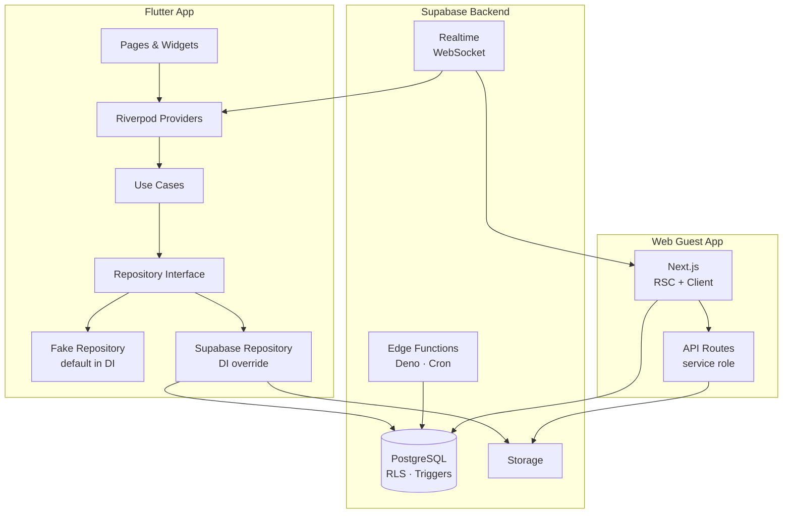

# Lazzo

**Plan fast, remember forever.**

Lazzo is a mobile app that turns event planning and shared memories into one flow. Create an event in seconds, share a link for guests to RSVP and upload photos — no install required. When the event ends, everyone gets a shared memory and hosts can generate shareable cards for socials. Currently in active beta on iOS (TestFlight) and web.

---

## Built with

- **App:** Flutter 3.5 (Dart 3), Riverpod 2
- **Backend & DB:** Supabase — PostgreSQL, Row Level Security (RLS), DB triggers, Storage, Realtime (WebSocket channels), Edge Functions (Deno), cron-scheduled jobs
- **Auth:** Supabase OTP magic-link — zero-friction guest auth, no account required
- **Analytics:** PostHog (Cloud EU) — full funnel instrumentation across app and web, feature flags
- **CI/CD:** GitHub Actions (lint → test → coverage → APK build), Vercel
- **Integrations:** deep links (app_links), QR codes, image compression/WebP, native share, calendar export, push notifications

The guest web experience lives in a separate repository and shares the same Supabase backend:
https://github.com/joaomsgomes/lazzo-invites-web

---

## Architecture

This app follows **Clean Architecture** with strict layer separation:

```
lib/features/<feature>/
├── domain/        # Pure Dart — entities, repository interfaces, use cases
│                  # Zero Flutter or Supabase imports allowed
├── data/          # Repository implementations, DTOs, remote data sources
└── presentation/  # Riverpod providers, pages, feature widgets
```



**Key patterns:**

- **Repository + Use Case pattern** — UI never calls Supabase directly. All data flows through use cases and typed repository interfaces. This enforces a clear boundary and makes every layer independently replaceable.

- **Fake-first DI** — default provider wiring in `main.dart` uses in-memory fake repositories. A single override switches to Supabase. This means features can be built and tested without a live backend, and the architecture is validated without network dependency.

- **Riverpod with `AsyncValue<T>`** — all loading, error, and empty states are handled uniformly via `AsyncValue`. No manual boolean flags.

- **Tokenized design system** — all colors, spacing, and typography come from `shared/themes/` and `shared/constants/`. No hardcoded hex values or magic numbers anywhere in the codebase. Design tokens are synchronized with the web companion app.

- **Shared components** — reusable, stateless widgets live in `shared/components/`. Feature-specific widgets stay in `features/<feature>/presentation/widgets/`. No mixing.

**State machine:** Events follow an explicit lifecycle: `planning → living → recap → closed`. Phase transitions are triggered by PostgreSQL triggers and Supabase Edge Functions.

**Cross-platform sync:** Supabase Realtime channels (WebSocket) keep the native app and web guest page in sync — photo uploads and RSVP updates propagate in real time.

---

## Testing & CI

**Testing stack:**
- `flutter_test` — unit and widget tests
- `mocktail` — interface mocking (Riverpod-compatible, no code generation)
- `faker` — deterministic fake data generation

**Coverage:**
- `flutter test --coverage` runs on every push and PR
- `lcov.info` artifact uploaded per PR (3-day retention) for branch coverage review

**CI pipeline (GitHub Actions — `.github/workflows/ci-dev.yml`):**

```
checkout → java 17 → flutter 3.5 → pub get
→ flutter analyze      (zero violations required)
→ dart format          (format check)
→ flutter test --coverage
→ upload coverage artifact
→ [main branch only] build debug APK with Supabase secrets
```

**Quality gates enforced before merge:**
- `flutter analyze` passes with zero violations
- No `print()` debug statements (enforced via `./scripts/clean_prints.sh`)
- `const` constructors used throughout
- Tokens used — no hardcoded values

**Scheduled cron jobs (separate workflows):**
- `cron-notify-events-ending.yml` — every 5 minutes, triggers Edge Function
- `cron-notify-uploads-closing.yml` — every 10 minutes, triggers Edge Function

---

## Running the project locally

**Prerequisites:** Flutter SDK (3.5+), Xcode (iOS) or Android Studio.

1. Clone the repo.
2. Copy `.env.example` to `.env` and fill in your [Supabase](https://supabase.com) project URL and anon key (Settings → API).
3. Pass those values as dart-defines when running:
   ```bash
   flutter run --dart-define=SUPABASE_URL=your_url --dart-define=SUPABASE_ANON_KEY=your_key
   ```
4. Or configure them in your IDE run configuration (recommended for development).

The web companion does not need to be running to use the app.

---

## Current status

- **Active beta** — iOS via TestFlight; guests participate at [getlazzo.com](https://getlazzo.com/).
- **Beta cohort (April 2026):** 25 users, 25 invite opens → 19 RSVPs (76% conversion). Full funnel tracked via PostHog.
- **How to get access:** [getlazzo.com](https://getlazzo.com/) or [realeventapp@gmail.com](mailto:realeventapp@gmail.com).

---

## Links

- **Website:** [getlazzo.com](https://getlazzo.com/)
- **Web companion repo:** [github.com/joaomsgomes/lazzo-invites-web](https://github.com/joaomsgomes/lazzo-invites-web)
- **TestFlight:** [Join the beta](https://testflight.apple.com/join/G8Q7wWbc)

---

For the full product case study (problem, research, V1→V2 pivot, and learnings) see [`CASE_STUDY.md`](CASE_STUDY.md).

For architecture, feature development, and agent rules, see `AGENTS.md` and `.agents/`.
